# W-Safe 

<p float="left">
  
  
  
  
  
</p>

<br/>
<p align="center">
  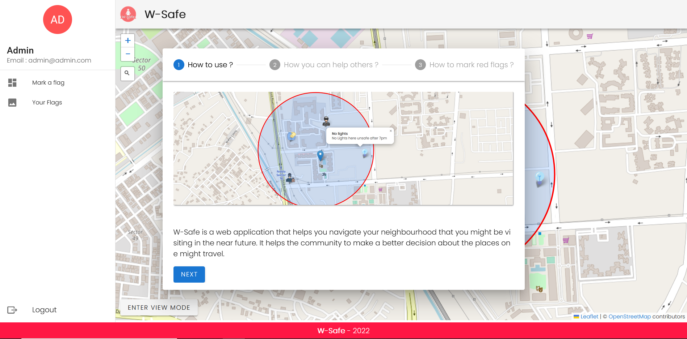
  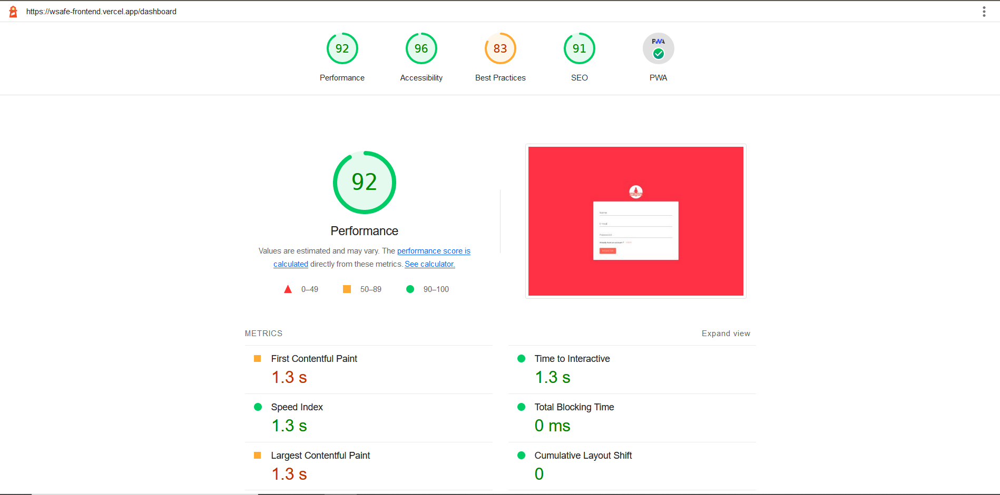
</p>
<b>
  W-Safe is a Progressive Web Application that helps you navigate your
                  neighbourhood that you might be visiting in the near future.
                  It helps the community to make a better decision about the
                  places one might travel.
  You can help others by marking the places where you have been
                  to recently and experienced something which was not safe. You
                  can select from different types of markers to provide a
                  detailed description about that place.
  <br/>
  Link : https://wsafe-frontend.vercel.app/
  <br/>
Test UserId :admin@admin.com
  <br/>
Password    :admin123   
</b>


## Screens for User-role

* ### Landing Page ### 
<p align="center">
  
  <h5>Landing Page</h5>
  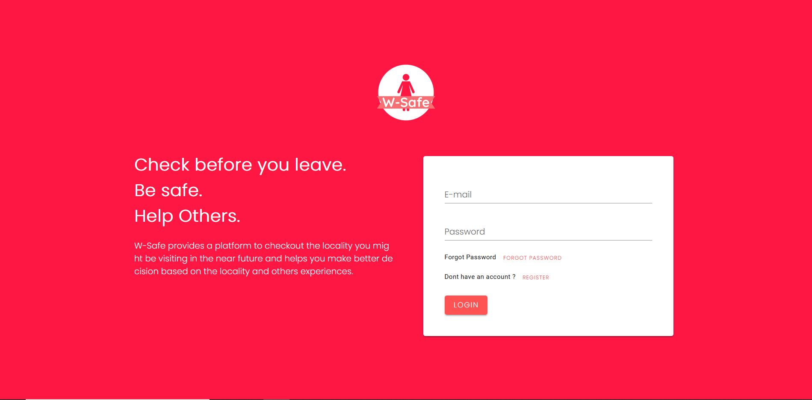
</p>

* ### Login ###
<p align="center">
  
</p>

* ### Forgot Password ###
<p align="center">
  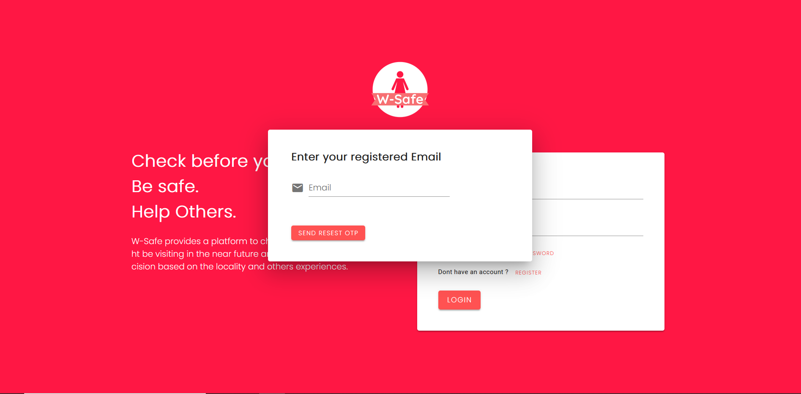
</p>

* ### OTP Verification ###
<p align="center">
  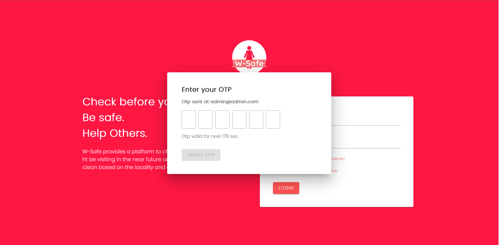
</p>

## Screens for Dashboard

* ### List Your Event ### 
<p align="center">
  
</p>
<p align="center">
  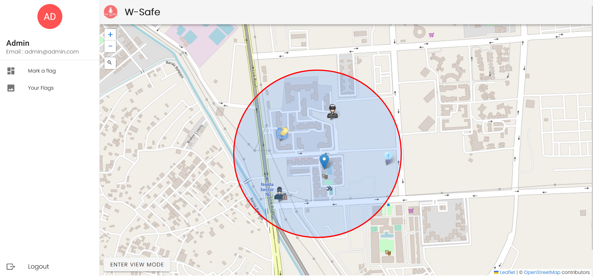
</p>
* ### Add Marker ### 
<p align="center">
  
</p>
* ### Your Marker ### 
<p align="center">
  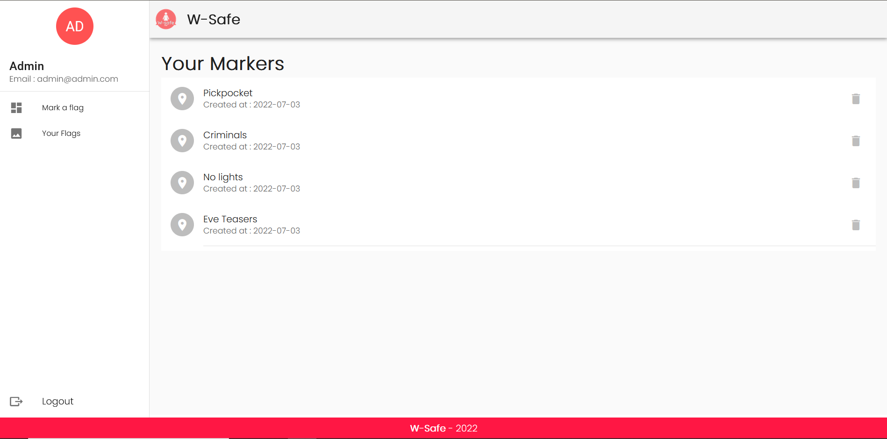
</p>

 ### PWA Snapshots ### 
<div style="display:flex;flex-direction:row;gap:30px">
  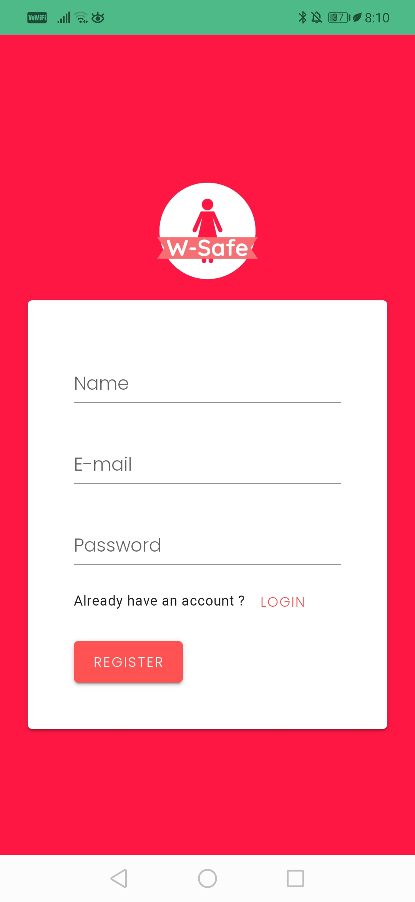
  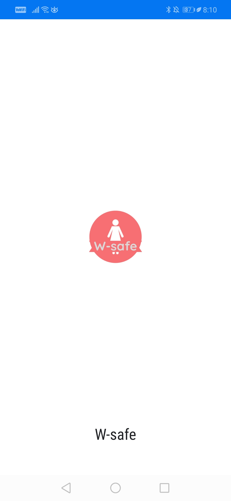
  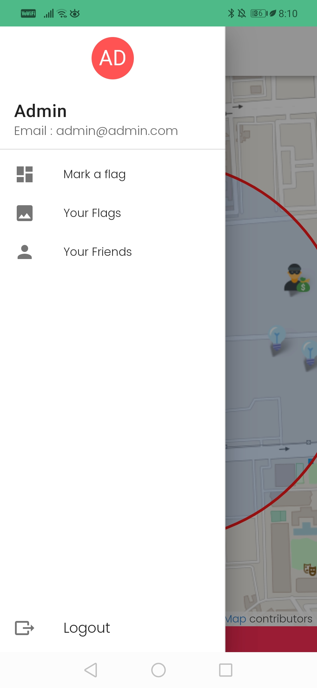
  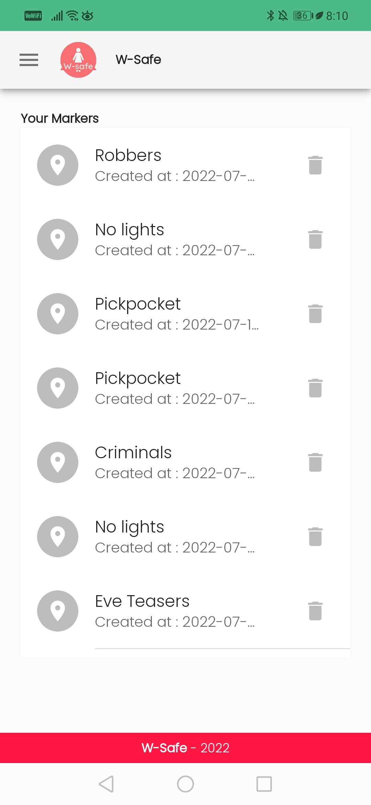
  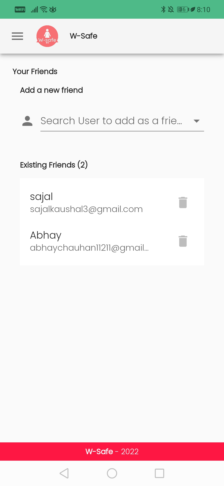
  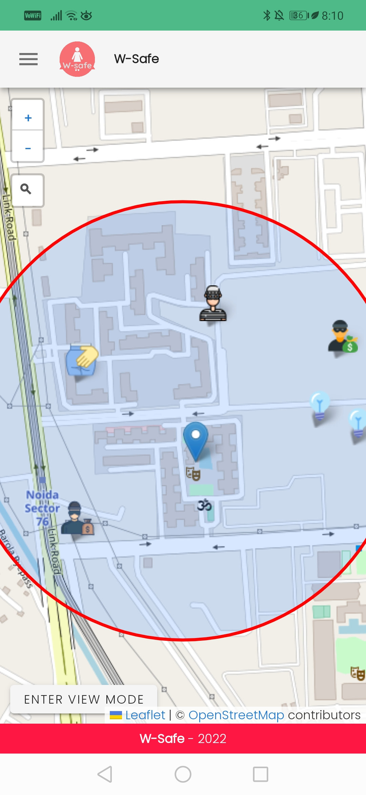
</div>

## Project setup
```
yarn install
```

### Compiles and hot-reloads for development
```
yarn serve
```

### Compiles and minifies for production
```
yarn build
```

### Lints and fixes files
```
yarn lint
```

### Customize configuration
See [Configuration Reference](https://cli.vuejs.org/config/).
